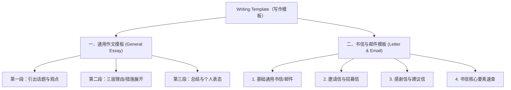

# Writing Template｜写作模板

> 🧭 **知识地图**：[[00-Writing Map（写作导航图）|返回写作导航导图]]  
> 方括号 `[...]` 中的内容按题目要求替换。讲义核心分为**通用作文模板**与**书信/邮件模板**两大体系。



---

## 一、通用作文模板｜General Essay Template

**适用范围：** 一般议论文、观点对比类、原因分析类、好处益处类、措施建议类等普通话题作文（**注意：书信、邮件类题目不适用此框架**）。

### 第一段：引出话题与观点（Introduction）

```text
It is well known that [Topic] is very important in our lives.
众所周知，[主题] 在我们生活中很重要。

It is well known that [Topic] is very popular and trendy in our lives.
众所周知，[主题] 在我们生活中非常流行、时尚。

As a matter of fact, [Topic] is good/bad for us in many ways.
事实上，[主题] 在很多方面对我们有好处/坏处。

Some people enjoy/think that [View A], but some people like/think that [View B].
一些人喜欢/认为 [观点 A]，但另一些人喜欢/认为 [观点 B]。

As for me, [My opinion]. / In my opinion, [My opinion].
至于我，…… / 在我看来，……

Here are the reasons/benefits/things we should do.
以下是原因/好处/我们应做的事情。
```

### 第二段：展开理由或措施（Body Paragraph）

```text
First of all/Firstly, it is obvious that [Reason 1].
首先，显而易见，……

In addition/Secondly, there is no doubt that [Reason 2].
此外/其次，毫无疑问，……

Last but not least/Finally, it goes without saying that [Reason 3].
最后但同样重要的是/最后，不用说，……
```

> 💡 **讲义提分提示**：写作中必须规范使用“首先（First of all）、其次（In addition）、最后（Last but not least）”等逻辑衔接词，使行文条理清晰。措施类作文可直接写具体措施，不必强行套用 `it is obvious that` 等套句。

### 第三段：总结升华（Conclusion）

```text
As a result, as far as I am concerned, [Conclusion].
因此，就我而言，……
```

---

## 二、书信与邮件模板｜Letter & Email Templates

**适用范围：** 题干要求写给某人的信件（Letter）或电子邮件（Email），包含日常交流、经历分享、邀请、感谢、建议、咨询等。

### 1. 基础通用书信/邮件模板｜General Email and Letter

**适用场景：** 日常沟通、经历分享、通知告知、回信等。

```text
Dear [Name],
亲爱的 [姓名]：

I am writing to tell you that [Purpose / Main event].
我写信是想告诉你……

[Write the details required by the question.]
[根据题目要求写具体内容：时间、地点、经历、感受等。]

I wish you and your family good health and happiness.
祝你和你的家人健康、幸福。

I am looking forward to meeting you.
我期待与你见面。

I am looking forward to your early reply.
我期待你的早日回复。

Yours,
[Your Name]
你的，
[姓名]
```

---

### 2. 邀请信与招募信模板｜Invitation & Recruitment Letter

**适用场景：** 邀请朋友/外教参加聚会、会议、比赛、节日庆祝或社团招募等。

```text
Dear [Name],
亲爱的 [姓名]：

I am writing to invite you to join us for [Event].
我写信是想邀请你参加我们的 [活动]。

I think it would be a good idea if you participated in [Event].
我认为如果你参加 [活动] 会是个好主意。

The [contest / conference / activity / ceremony] will be held on [Date], at [Place].
比赛/会议/活动/仪式将于 [时间] 在 [地点] 举行。

I am sure that your presence will add more charm to the [event].
我相信你的到来会为这场活动增添更多魅力。

Many outstanding participants will join us, and I am sure that you will have an unforgettable time there.
届时许多优秀参与者将参加，我相信你会在那里度过难忘的时光。

Please let me know whether you can come. My phone number is [Phone Number].
请告诉我你是否能来。我的电话号码是 [电话号码]。

I really hope you can make it. I am looking forward to your reply.
我真心希望你能来，期待你的回复。

Yours,
[Your Name]
你的，
[姓名]
```

---

### 3. 感谢信与建议信模板｜Thank-you & Suggestion Letter

**适用场景：** 向他人表达谢意，或针对社会现象、环境治理、校园生活等提出具体建议。

```text
Dear [Name],
亲爱的 [姓名]：

I am writing to express my heartfelt gratitude / give some advice and suggestions.
我写信是为了表达由衷的感谢 / 提出一些建议。

I am writing about [Event / Problem].
我写信是关于 [某事/某问题]。

As a student, I would like to offer some suggestions concerning [Problem].
作为一名学生，我想针对 [问题] 提出一些建议。

It is widely known that the problem is still serious although some measures have already been taken.
众所周知，尽管已经采取了一些措施，这个问题仍然很严重。

In my opinion, on the one hand, the media should report more about it and encourage people to pay attention to its influence.
在我看来，一方面，媒体应更多报道它，并呼吁人们关注其影响。

On the other hand, the government and relevant officials should make more rules to deal with the [Problem] problem.
另一方面，政府和相关部门应制定更多规则来处理 [问题]。

Thank you for your attention to this letter. I hope you will find these suggestions useful.
感谢你对这封信的关注。我希望这些建议对你有用。

Yours,
[Your Name]
你的，
[姓名]
```

> 💡 **讲义提分提示**：提出建议时，推荐从“媒体宣传（the media）”和“政府/相关部门（the government and relevant officials）”两个宏观角度切入，既有格局又便于记忆。

---

### 4. 书信核心要素与高频句式速查｜Letter Elements & Patterns

| 书信结构模块                  | 核心高频表达（English）                                                                                                                         | 中文释义                                             |
| :---------------------- | :-------------------------------------------------------------------------------------------------------------------------------------- | :----------------------------------------------- |
| **称呼 (Salutation)**     | `Dear [Name],`                                                                                                                          | 亲爱的……                                            |
| **开头目的句 (Purpose)**     | `I am writing to tell you that...` <br> `I am writing this email to invite you to...` <br> `I am writing to give you some advice on...` | 我写信是想告诉你…… <br> 我写这封邮件想邀请你…… <br> 我写信是想就……给你提些建议 |
| **承接细节 (Body Details)** | `The activity will take place at... / begin at...` <br> `First of all,... In addition,... Last but not least,...`                       | 活动将在……举行 / 于……开始 <br> 首先……此外……最后……               |
| **结尾期盼 (Expectation)**  | `I am looking forward to meeting you.` <br> `I am looking forward to your early reply.` <br> `I really hope you can come and join us.`  | 我期待与你见面。 <br> 我期待你的早日回复。 <br> 我真心希望你能来参加。        |
| **结尾祝愿 (Wishes)**       | `I wish you and your family good health and happiness.`                                                                                 | 祝你和家人健康幸福。                                       |
| **落款署名 (Sign-off)**     | `Yours,` <br> `[Your Name]`                                                                                                             | 你的， <br> [署名]                                    |

---

## 🔗 导航与关联
- 🔙 **返回总览**：[[00-Writing Map（写作导航图）]]
- 💎 **万能金句**：[[Universal Sentence|万能句子总库]] · [[07. 聚会、活动与邀请（Activities & Invitations）]]
- 📚 **实战范文**：[[Model Essay|范文总库]] · [[16. Travel Advice Email（给 Mike 的旅游建议信）]]