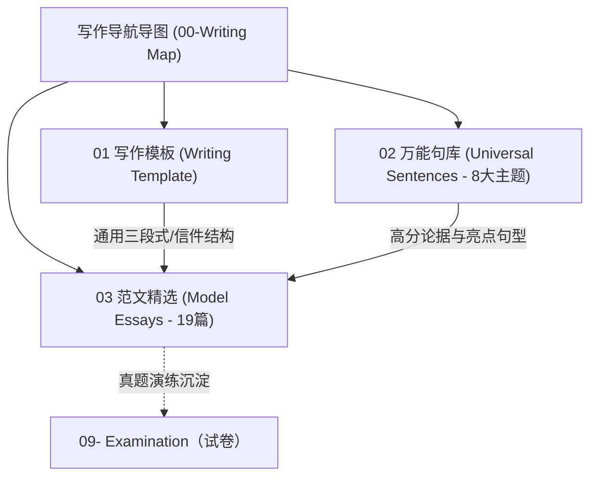

---
tags:
  - degree-english
  - writing
  - map
  - MOC
title: 写作导航导图（Writing Map）
source: 曹胖傻瓜式写作课程讲义 3.0
---

# 写作导航导图（Writing Map）

> 本文件为 `08-Writing（写作）` 模块的顶层知识地图（Map of Content）。汇总了**写作模板**、**8 大主题万能句**与 **19 篇精选真题范文**，支持一键直达与网状联想学习。

---

## 🏛️ 一、三大完整原始总库（全文检索入口）

保留的 3 个双语大文件作为全量知识储备与 Obsidian 全文关键词检索入口：

| 模块名称 | 核心定位与说明 | 双链入口 |
| :--- | :--- | :--- |
| **写作模板总库** | 包含通用作文、邮件信件、邀请/招募、感谢/建议四大模板 | [[Writing Template]] |
| **万能句子总库** | 包含 11 个分类共 60 条金牌高分万能句（双语对照） | [[Universal Sentence]] |
| **范文总库** | 包含 15 篇普通作文与 4 篇书信邮件（共 19 篇双语全文） | [[Model Essay]] |

---

## 📐 二、写作模板体系（Writing Template）

写作模板单文件架构已按**通用作文模板**与**书信/邮件模板**两大体系结构化分类：

- 📑 **[[Writing Template#一、通用作文模板｜General Essay Template|一、通用作文模板（General Essay Template）]]**
  - **首段**：引出话题与观点（`It is well known that... / As for me, ...`）
  - **二段**：三层理由/措施展开（`First of all... / In addition... / Last but not least...`）
  - **末段**：总结升华（`As a result, as far as I am concerned, ...`）
- ✉️ **[[Writing Template#二、书信与邮件模板｜Letter & Email Templates|二、书信与邮件模板（Letter & Email Templates）]]**
  - **1. 基础通用书信/邮件**：[[Writing Template#1. 基础通用书信/邮件模板｜General Email and Letter|通用交流、经历分享与告知]]
  - **2. 邀请信与招募信**：[[Writing Template#2. 邀请信与招募信模板｜Invitation & Recruitment Letter|聚会/活动邀请、增添魅力]]
  - **3. 感谢信与建议信**：[[Writing Template#3. 感谢信与建议信模板｜Thank-you & Suggestion Letter|致谢、媒体与政府双向建议]]
  - **4. 书信核心要素速查**：[[Writing Template#4. 书信核心要素与高频句式速查｜Letter Elements & Patterns|称呼、目的句、期盼祝福与落款]]

---

## 💎 三、8 大主题万能句库（Universal Sentences）

将 60 条万能句按高频考点场景细化拆分为 8 个主题专题，点击即可直达学习：

| 专题序号 | 主题名称 | 核心考点与应用场景 | 句子数量 | 直达链接 |
| :---: | :--- | :--- | :---: | :--- |
| **01** | **重要性与意义** | 阐述事物价值、自我价值实现（`realize my self-worth`）、绝对必要三连词 | 7 句 | [[01. 重要性与意义（Importance & Significance）]] |
| **02** | **好处与优缺点** | 论述收益好处、省钱省麻烦（`save money / trouble`）、享受自由、优缺点辩证分析 | 13 句 | [[02. 好处与优缺点（Benefits & Pros and Cons）]] |
| **03** | **社交与人际关系** | 结交朋友拓展社交（`which enriches my social life`）、陪伴家庭朋友 | 3 句 | [[03. 社交与人际关系（Making Friends & Social Life）]] |
| **04** | **运动与健康生活** | 体育运动、强身健体（`keep fit`）、身心放松与减压（`reduce stress`） | 5 句 | [[04. 运动与健康生活（Exercise, Sports & Health）]] |
| **05** | **旅游与出行** | 旅行经历、家乡景点介绍、天气与着装、正规交通与人身安全（`stay safe`） | 9 句 | [[05. 旅游与出行（Travel & Transportation）]] |
| **06** | **环保与建议措施** | 雾霾与污染危害、植树净化空气、节约用水、万能建议段落（媒体+政府） | 7 句 | [[06. 环保与建议措施（Environment & Suggestions）]] |
| **07** | **聚会、活动与邀请** | 聚会活动时间地点、文娱流程、节日习俗、书信真诚邀请与增添魅力 | 11 句 | [[07. 聚会、活动与邀请（Activities & Invitations）]] |
| **08** | **学习与自我提升** | 英语学习五步法高分段落、学习习惯养成、保持耐心与反思记录 | 5 句 | [[08. 学习与自我提升（Learning & Self-Improvement）]] |

---

## 📚 四、19 篇精选真题范文索引（Model Essays）

### A. 普通作文（15 篇）

| 篇号 | 范文标题 | 题材与考点 | 核心万能句关联 | 范文链接 |
| :---: | :--- | :--- | :--- | :--- |
| **01** | My Favorite Job | 职业选择与原因 | 自我价值、陪伴亲友 | [[01. My Favorite Job（我最喜欢的工作）]] |
| **02** | E-books or Paper Books | 观点对比与选择 | 省钱省麻烦、环境保护 | [[02. E-books or Paper Books（电子书还是纸质书）]] |
| **03** | My Hobby | 兴趣爱好与生活 | 强身健体、放松减压、交友 | [[03. My Hobby（我的爱好）]] |
| **04** | I Like Playing Sports | 体育运动与健身 | 运动好处、结交朋友 | [[04. I Like Playing Sports（我喜欢运动）]] |
| **05** | Fight against Haze | 环保危害与措施 | 雾霾危害、公共交通、植树净化 | [[05. Fight against Haze（抗击雾霾）]] |
| **06** | Watching Movies at Home or in a Cinema | 娱乐生活与选择 | 省钱省事、时间自由 | [[06. Watching Movies at Home or in a Cinema（在家看电影还是去电影院）]] |
| **07** | Exercise Every Day | 坚持锻炼的好处 | 保持健康、减压、绝对必要 | [[07. Exercise Every Day（每天锻炼）]] |
| **08** | Let's Save Water | 资源节约与行动 | 水资源危机、节水设备、政策立法 | [[08. Let's Save Water（节约用水）]] |
| **09** | Live a Healthy Life | 健康生活方式 | 均衡饮食、规律作息、运动 | [[09. Live a Healthy Life（过健康的生活）]] |
| **10** | Green Transportation | 绿色低碳出行 | 骑行强身、省钱省事、节能减排 | [[10. Green Transportation（绿色出行）]] |
| **11** | Spring Is Coming | 季节描绘与户外活动 | 景物描写、聚会踢球、关爱老人 | [[11. Spring Is Coming（春天来了）]] |
| **12** | An Unforgettable Holiday | 难忘假期与旅游 | 景点名胜、当地人友善、美食 | [[12. An Unforgettable Holiday（难忘的一个假期）]] |
| **13** | My Favorite Chinese Festival | 传统节日与习俗 | 春节聚会、美食、丰富社交 | [[13. My Favorite Chinese Festival（我最喜欢的中国节日）]] |
| **14** | Raising Pets | 宠物陪伴与生活 | 快乐减压、身心放松、家庭陪伴 | [[14. Raising Pets（养宠物）]] |
| **15** | Start Your Own Business or Find a Job | 创业就业规划 | 学习新知、自我实现、支配自由 | [[15. Start Your Own Business or Find a Job（创业还是就业）]] |

### B. 书信与邮件（4 篇）

| 篇号 | 范文标题 | 书信类型与情境 | 核心万能句关联 | 范文链接 |
| :---: | :--- | :--- | :--- | :--- |
| **16** | Travel Advice Email | 旅行建议信（给 Mike） | 天气穿衣、随身安全、名胜推荐 | [[16. Travel Advice Email（给 Mike 的旅游建议信）]] |
| **17** | Volunteer Activity Email | 经历分享信（给 Tom） | 志愿服务、关爱老人、自我价值 | [[17. Volunteer Activity Email（给 Tom 的志愿活动邮件）]] |
| **18** | Weekend Party Invitation | 生日聚会邀请信（给 Tom） | 邀请套句、时间地点、娱乐流程 | [[18. Weekend Party Invitation（邀请 Tom 参加周末小聚会）]] |
| **19** | Introduce a Chinese Festival Email | 节日文化介绍信（给 John） | 春节由来、神话传说、传统民俗 | [[19. Introduce a Chinese Festival Email（给 John 回信介绍中国传统节日）]] |

---

## 🔄 五、跨模块联动与知识网络

- **语法支撑**：
  - 作文三段式展开必备：[[连词 conjunction|并列与从属连词]] · [[从句 clause|定语从句与状语从句]]
  - 主谓一致与时态校验：[[主谓一致 subject verb agreement|主谓一致]] · [[动词时态 verb tense|动词时态]]
- **词汇与短语沉淀**：
  - 高频短语搭配：[[Verb Phrases]]
- **真题全卷演练**：
  - 历年学位英语真题 Part V 写作实战：[[2016年真题|历年真题写作演练]]
