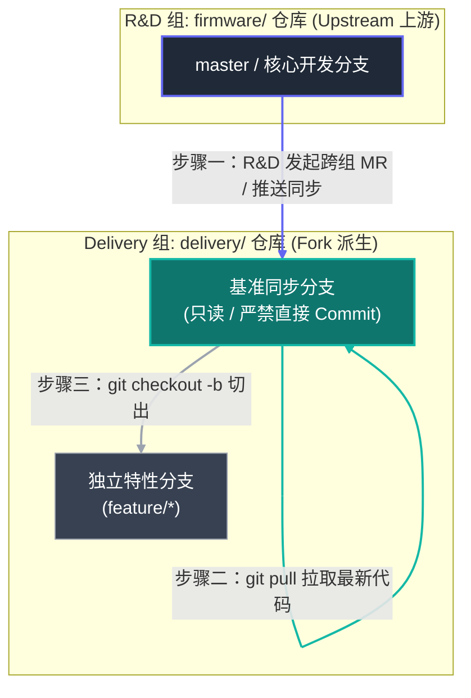

# Git Workflow for the R&D and Delivery Teams

> [!info] 文档信息
> * **作者**：**简清**
> * **日期**：2026-08-03
> * **版本**：`v1.0.0`

## 一、 核心概念

- **Fork（派生）**：将 **R&D 上游仓库** 复制为 **Delivery 下游组** 专用的副本仓库。
- **同步/合并（反向跨组 MR）**：是将上游原仓库（Upstream）后续产生的新提交拉取更新到自己派生仓库（Fork）的过程
- **MR（合并请求）：** 跨仓库或跨分支进行代码审查与合并的机制。
- **上游核心维护者**：**R&D Team** 项目核心成员，负责主线代码研发以及向 Delivery 仓库的同步维护。
- **下游特性开发者**：**Delivery Team** 项目成员，基于 Delivery 组内的派生仓库进行定制特性开发。
- **基准同步分支**：Delivery 仓库中专门用于接收上游更新的**只读分支**。
- **独立特性分支**：Delivery 开发者为特定需求建立的工作分支（格式统一为 `feature/*`）。

由于 **GitLab Web UI** 在同步非默认分支和逆向合并上存在限制，最佳实操通常推荐使用 **“Web UI 一键派生 + Git 命令行精准同步”** 的组合模式。

## 二、仓库拓扑与代码流向



## 三、权限边界与视角分工

### 3.1 上游核心维护者视角（R&D Team）

- **Fork 仓库**：将项目从 **`firmware` 组** 派生（Fork）至 **`delivery` 组**，并立即清理派生库中无关的历史冗余分支。 ![[Pasted image 20260803155145.png]]
- **维持上游分支简洁**：定期清理 `firmware` 原仓库中已废弃或已合并的非默认分支，降低版本库冗余。
- **同步分支：** 当上游产生新版本或 Bug 修复后，由 R&D 维护者在 GitLab Web 端发起反向 **MR**（或通过命令行），将更新合并至 `delivery` 仓库的**基准同步分支**；更新完成后通知 Delivery 团队。![[Pasted image 20260803155448.png]]

### 3.2 下游特性开发者视角（Delivery Team）

- **保证同步分支纯净**：**严禁**直接在 Delivery 仓库的“基准同步分支”上修改代码或提交 Commit。该分支仅作为与 R&D 上游保持绝对同步的**只读基准**。
- **开辟独立特性分支**：每次开发新需求时，基于最新的**基准同步分支**创建独立的 **特性分支**（如 `feature/*`），将开发改动与上游更新彻底隔离。

常用操作：
```bash
# 1. 切换并拉取最新的基准同步分支
git checkout V100_ARGB
git pull origin V100_ARGB

# 2. 基于同步分支开辟特性分支
git checkout -b feature/V100_ARGB-aula
```

## 四、预留演进规则（当前阶段暂不启用）

**注**：以下规则在当前阶段**暂不生效**，仅作为后续团队规模扩大、开启跨组代码回馈时的机制预留。

- **规范下游 MR 提交质量**：要求 Delivery 开发者向 `delivery` 主干或 R&D 提交代码时，必须基于独立的 `feature/*` 分支发起 MR，拒绝直接合并杂乱提交，以确保代码评审（Code Review）的原子性与可追溯性。
- **下游代码向上游反向回馈**：Delivery 团队定制开发的通用特性或 Bug 修复，需通过 MR 申请合并回 `firmware` 原仓库。

## 五、AI 操作注意事项

让 AI Agent（如 Claude Code、Cursor、自定义自动化脚本等）直接执行 Git 命令时，必须遵循 **“只读查询完全放行、写入提交二次确认、破坏性指令绝对禁运”** 的安全原则。

由于 AI 缺乏对业务语境的深层感知且存在“幻觉”风险，盲目赋予其写权限或破坏性命令执行权极易导致**代码丢失**或**远端仓库历史被覆写**。

| **风险等级**                 | **命令类型**   | **代表性 Git 指令**                                                                                                      | **AI 操作授权策略**      | **潜在危害与安全管控说明**                                                           |
| ------------------------ | ---------- | ------------------------------------------------------------------------------------------------------------------- | ------------------ | ------------------------------------------------------------------------- |
| **高危 (Forbidden)**       | 破坏性历史重置与强推 | `git reset --hard`<br><br>  <br><br>`git push -f`<br><br>  <br><br>`git clean -fd`<br><br>  <br><br>`git branch -D` | **绝对禁止 AI 自动执行**   | 会导致未提交代码永久丢失，或破坏远端团队公共历史。<br><br>  <br><br>**管控**：系统层直接拦截命令拦截器。           |
| **中风险 (Require Review)** | 状态变更、提交与推送 | `git commit`<br><br>  <br><br>`git checkout -b`<br><br>  <br><br>`git merge`<br><br>  <br><br>`git push`            | **需人工复核 Diff 后执行** | 可能产生无效/乱码 Commit、切错基准分支或推送未经测试的代码。<br><br>  <br><br>**管控**：终端打印指令并等待确认。   |
| **低风险 (Safe)**           | 只读状态与历史查询  | `git status`<br><br>  <br><br>`git diff`<br><br>  <br><br>`git log`<br><br>  <br><br>`git fetch`                    | **完全放行**           | 纯只读操作，无破坏性，用于帮助 AI 理解当前上下文与冲突点。<br><br>  <br><br>**管控**：允许 AI Agent 自由调用。 |