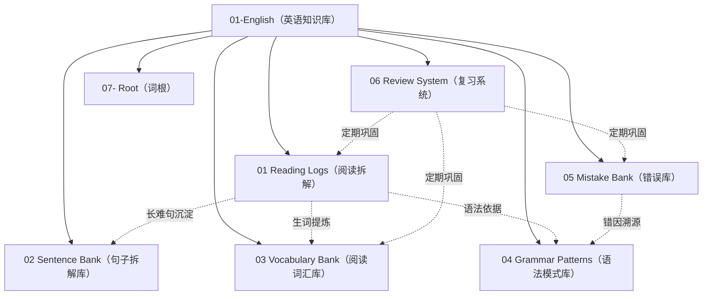

# English Module Workspace Guide (AGENTS.md)

本文件为 `01-English`（英语学习与知识库管理模块）的顶层工作指南与协作规范。所有参与本知识库维护、扩充、重构与内容生成的 Agent 必须严格遵守本文档所定义的目录架构、排版规范、Obsidian 双链标准及工作流（SOP）。

---

## 🗺️ 英语模块架构全景（Module Overview）

英语模块旨在构建一个从**真题输入**、**阅读拆解**、**语法归纳**到**词汇沉淀**与**错题复习**的高效闭环知识网络：



### 目录功能与定位

| 目录名称 | 核心职能 | 关键内容与文件 |
| :--- | :--- | :--- |
| **`01 Reading Logs（阅读拆解）`** | 真题/精读语篇的深度拆解 | 历年学位英语真题精读、段落大意、题源定位、长难句五步拆解 |
| **`02 Sentence Bank（句子拆解库）`** | 经典句型与长难句库 | 高频句型拆解、成分切分、翻译与句式改写 |
| **`03 Vocabulary Bank（阅读词汇库）`** | 核心词汇与短语分类库 | [[Verb Phrases]]（动词短语）、[[Word Contrasts]]（易混词辨析） |
| **`04 Grammar Patterns（语法模式库）`** | 27 篇系统化语法知识图谱 | 词法体系（10 篇）、动词专项（8 篇）、句法与特殊句式（6 篇）、综述与标点（3 篇） |
| **`05 Mistake Bank（错误库）`** | 错题归因与诊断诊所 | 真题与练习错题沉淀、错误选项干扰特征分析、知识点盲区定位 |
| **`06 Review System（复习系统）`** | 艾宾浩斯与周期复习体系 | 周期性复习清单、遗忘曲线巩固卡片 |
| **`07- Root（词根）`** | 构词法与词汇生成网络 | [[构词法 word-building]]（前缀、词根、后缀衍生体系） |

---

## 📐 排版与视觉标准化规范（Styling Standards）

所有在英语模块创建或修改的 Markdown 文档必须严格对标金标准模板（对标 `02 动词专项体系/使役动词 Causative Verb.md`）：

### 1. 标题与 Frontmatter 规范
- **YAML Frontmatter**：文档顶部必须包含标准分类 tags：
  - 词法文档：`tags: [grammar, morphology]`
  - 动词文档：`tags: [grammar, verb]`
  - 句法文档：`tags: [grammar, syntax]`
  - 标点符号：`tags: [grammar, punctuation]`
  - 阅读笔记：`tags: [reading]`, `passage: 真题`, `difficulty: ⭐️⭐️⭐️⭐️`
- **一级大标题**：统一采用 `# 中文名称（English Name）` 命名（中英双语，全角括号）。

### 2. 章节层级与结构骨架
1. **概念概览层（`## 什么是[语法概念]`）**：
   - 核心概念定义（中简明阐释）；
   - 核心语法公式块（使用 ````text ```` 代码块）；
   - 典型例句拆解列表（标明主语、谓语、宾语、表语等成分）；
   - 分类总览表格（Markdown 表格，包含分类、代表词、含义、关联章节）；
   - `---` 分割线。
2. **主干体系层（`## 一、...` / `### 1. ...` / `#### (1) ...`）**：
   - 中文数字编号主章节，阿拉伯数字编号子章节；
   - 句型结构公式使用 ````text ```` 独立展示；
   - **例句排版规范**：必须采用 Markdown 引用块，英中两行对照，行末加**两个空格**换行：
     ```markdown
     > English sentence here.  
     > 中文翻译写在这里。
     ```
3. **归纳对比层（`## 核心对比与总结`）**：
   - 使用 Markdown 表格横向对比易混概念、口诀与规则矩阵。
4. **错误诊断层（`## 常见错误`）**：
   - 采用 `❌` 与 `✅` 代码块直观对比，并附带诊断原因解析：
     ```markdown
     ```text
     ❌ 错误表达示例
     ✅ 正确标准表达
     ```
     - 诊断说明：为什么错，核心考点与规则。
     ```

---

## 🔗 Obsidian 双链与知识图谱规范（Graph & Wikilinks）

为保证在 Obsidian 知识图谱中形成无死链、高聚合的网状连接，必须遵守以下链接准则：

### 1. 行内上下文双链（In-text Wikilinks）
- 在任何解析或例句说明中，只要提及其他词性、动词、时态、从句或标点概念，必须使用 `[[目标文档名称]]` 或 `[[目标文档名称|显示文本]]`：
  - 例：`根据 [[主谓一致 subject verb agreement]] 原则，靠近谓语的是复数名词……`
  - 例：`详细结构可参见 [[从句 clause]] 与 [[非谓语动词 non-finite verb]]。`

### 2. 底部全网导航规范（Footer Navigation）
每篇语法笔记末尾必须包含标准的 `## 🔗 知识网络与双链导航` 模块：

```markdown
---

## 🔗 知识网络与双链导航

- **语法顶层导图**：[[英语语法综述 grammar Overview]] · [[词性 word class]]
- **本体系同级专题**：
  - [[相关专题 1]] · [[相关专题 2]] · **[[当前专题名称]]** · [[相关专题 3]]
- **跨模块联动专题**：
  - [[关联专题 A]] · [[关联专题 B]] · [[关联专题 C]]
```

---

## 📚 语法模式库（04 Grammar Patterns）27 篇全景索引

```text
c:\Users\Administrator\OneDrive\live\01-English\04 Grammar Patterns（语法模式库）\
├── 英语语法综述 grammar Overview.md       # 顶层架构与 27 篇全景总索引
├── 词性 word class.md                   # 单词身份证与十大词性速查
├── 标点符号 punctuation.md               # 句末/逗号/牛津逗号/分号/冒号/破折号/引号
├── 01 词法体系/
│   ├── 名词 noun.md                     # 可数/不可数/复数变化/所有格体系
│   ├── 冠词 article.md                  # a/an 音素/the 特指类指/零冠词
│   ├── 代词 pronoun.md                  # 人称/物主/反身/指示/不定代词
│   ├── 数词 numeral.md                  # 基数/序数/分数/倍数四大句型
│   ├── 形容词 adjective.md              # 定语后置/前置排序口诀/比较级最高级
│   ├── 副词 adverb.md                   # 频度/程度/形副同形/加不加 -ly 辨析
│   ├── 介词 preposition.md             # 空间点面体/时间跨度/排除辨析
│   ├── 连词 conjunction.md             # 并列连词就近原则/从属连词系统
│   ├── 叹词 interjection.md            # 11 类情感图谱/语体风格
│   └── 限定词 determiners.md            # 前位+中位+后位排序/中位互斥
├── 02 动词专项体系/
│   ├── 动词分类 verb Classification.md  # 五大谓语动词与五大基本句型
│   ├── 使役动词 Causative Verb.md       # make/let/have/get/主动省 to 被动补 to
│   ├── 系动词 linking verbs.md          # 状态/感官/保持/变化/表象系动词
│   ├── 动词时态 verb tense.md           # 4时间×4状态=16时态/一般过去vs现完
│   ├── 被动 Passive Voice.md            # 主变被五步法/8大时态被动/主动表被动
│   ├── 助动词和情态动词 auxiliary verbs and modal verbs.md # 推测体系/情态+have done
│   ├── 非谓语动词 non-finite verb.md     # to do/doing/done 句法功能总览
│   └── 虚拟语气 Subjunctive Mood.md     # 条件虚拟/错综时间/if省略倒装/(should) do
└── 03 句法与特殊句式/
    ├── 主谓一致 subject verb agreement.md # 语法一致/意义一致/就近就远原则
    ├── 从句 clause.md                   # 定语从句/名词性从句/状语从句九大类
    ├── 倒装 inversion.md                # 完全倒装/部分倒装/形式倒装
    ├── 强调 emphasize.md                # It is...that 还原法/do强调/the very
    ├── 独立主格 Absolute Construction.md# 逻辑主语+分词/with复合结构
    └── 省略 ellipsis.md                 # 词法省略/状语从句主谓省略
```

---

## 🛠️ Agent 维护与生成标准操作程序（SOP）

当用户要求 Agent 处理英语模块的任务时，必须按照以下流程执行：

### 1. 新增或扩充真题阅读拆解（Reading Logs）
1. 引用 `_templates/reading.md` 模板；
2. 原文录入完整段落，每题标注题号、选项、答案与精准考点解析；
3. `📘 Sentence Breakdown` 对长难句执行**五步精细拆解**（原句 -> 结构切分 -> 译文 -> 考点要点 -> 仿写/改写）；
4. 在长难句中提及语法知识点时，嵌入对应的 `[[...]]` 双链。

### 2. 词汇与词根扩展（Vocabulary & Root）
1. 录入单词时需标注词性缩写（如 `v.`, `adj.`, `n.`，见 [[词性 word class]]）；
2. 动词短语录入到 `03 Vocabulary Bank/Verb Phrases.md`；
3. 易混辨析词对录入到 `03 Vocabulary Bank/Word Contrasts.md`（采用表格对比核心差异与例句）；
4. 词根衍生词录入到 `07- Root/构词法 word-building.md`。

### 3. 语法笔记维护与修复
1. 严格保留现有的 `# 中文名称（English Name）` 与 Markdown 结构体系；
2. 保持引用块例句与双链导航完整；
3. 任何新建的语法小专题必须同步更新到 [英语语法综述 grammar Overview.md](file:///c:/Users/Administrator/OneDrive/live/01-English/04%20Grammar%20Patterns%EF%BC%88%E8%AF%AD%E6%B3%95%E6%A8%A1%E5%BC%8F%E5%BA%93%EF%BC%89/%E8%8B%B1%E8%AF%AD%E8%AF%AD%E6%B3%95%E7%BB%BC%E8%BF%B0%20grammar%20Overview.md) 与 [词性 word class.md](file:///c:/Users/Administrator/OneDrive/live/01-English/04%20Grammar%20Patterns%EF%BC%88%E8%AF%AD%E6%B3%95%E6%A8%A1%E5%BC%8F%E5%BA%93%EF%BC%89/%E8%AF%8D%E6%80%A7%20word%20class.md) 的索引中。
